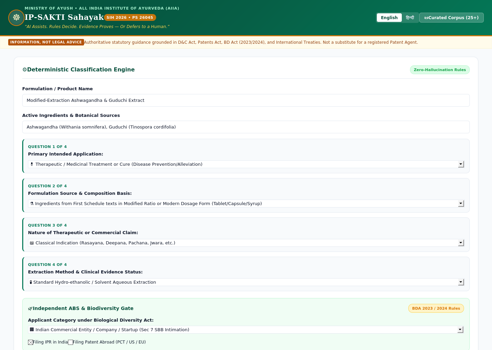
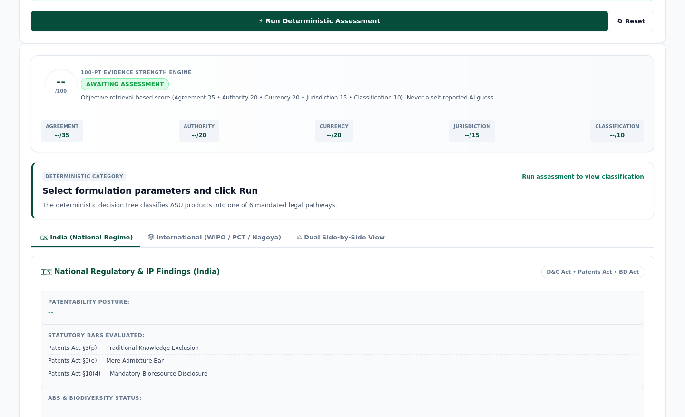

<div align="center">


# ⚖️ IP-SAKTI Sahayak

### AI Assists. Rules Decide. Evidence Proves — Or Defers to a Human.

A multilingual, source-cited AI assistant that gives Ayurveda innovators, IP facilitators, and
policy reviewers a deterministic, evidence-graded answer to *"what does the law say about my product?"*
— and honestly says **"I don't know, ask a human"** when the evidence doesn't support a confident one.

[](https://github.com/coders-of-gnit/ipsakti-sahayak/actions/workflows/tests.yml)


**Problem Statement 26045** · Ministry of AYUSH / All India Institute of Ayurveda (AIIA) · Team **Coders of GNIT**

[Overview](#-overview) · [Demo](#-see-it-in-action) · [Architecture](#-how-it-works) · [Quickstart](#-quickstart) · [API](#-api-reference) · [Testing](#-testing) · [Roadmap](#-roadmap)

</div>

<br>

## 🧭 Overview

If you're an Ayurveda founder, you've probably asked yourself:

> *"Can I actually patent this formulation? Do I need government clearance to use these plants
> commercially? Is my product legally a medicine, a supplement, or a cosmetic?"*

Almost nobody can answer that on their own — you'd need a lawyer who understands **both** Ayurveda
**and** multi-regime IP law, and that person is nearly impossible to find. Meanwhile, India has
already lost patent disputes abroad over turmeric, neem, and basmati — proof that this gap has
real, national consequences.

**IP-SAKTI Sahayak closes that gap.** It classifies a product into one of 6 legally defined
categories, checks biodiversity (ABS) compliance independently, retrieves grounded statutory
evidence, and scores its own confidence out of 100 — before it ever gives an opinion. If the score
is high, you get a cited answer. If it isn't, the system defers to a human instead of guessing.

<br>

## ✨ Why It's Different

| | Most "Legal AI" Tools | IP-SAKTI Sahayak |
|---|---|---|
| **Category decision** | LLM infers it in free text | A **deterministic rule tree** decides — the LLM only phrases questions |
| **Confidence** | Self-reported by the model ("I'm 95% sure") | A calculated **100-point evidence score** (agreement, authority, currency, jurisdiction) |
| **When unsure** | Answers anyway | **Safely abstains** and generates a structured Review Brief for a human |
| **Jurisdictions** | Often blended together | India and International are computed together, **shown separately** |
| **TKDL access** | Claims a live API it doesn't have | Honestly builds a structured **Search Bridge** query instead |

<br>

## 🖥️ See It In Action

<div align="center">


<sub><i>The deterministic classification engine — a real running screenshot, not a mockup.</i></sub>
</div>
<br>
<div align="center">


<sub><i>The 100-point Evidence Strength Engine and dual-jurisdiction findings panel.</i></sub>
</div>

<br>

## 🏗️ How It Works

```
                          USER
              Formulation description (English / Hindi · Bhashini-ready)
                                │
                ┌───────────────┴────────────────┐
                ▼                                 ▼
     CLASSIFICATION ENGINE                  ABS / TK GATE
   Deterministic 6-category tree      3-tier biodiversity compliance
     (max 4 questions, no LLM)         (Foreign / Indian / Exempt)
                │                                 │
                └───────────────┬─────────────────┘
                                 ▼
                      EVIDENCE RETRIEVAL
          BM25 search over a curated, verified statutory corpus
                                 ▼
                  EVIDENCE STRENGTH ENGINE (/100)
     Agreement 35 · Authority 20 · Currency 20 · Jurisdiction 15 · Classification 10
        Hard gates: stale source · contradiction · borderline classification
                                 │
                  ┌──────────────┴───────────────┐
                  ▼                               ▼
          HIGH CONFIDENCE (≥ 75)          MODERATE / LOW (< 75)
        Source-cited answer                  Safe abstention
      + mandatory disclaimer         + structured Facilitator Review Brief
```

**The one rule that matters most:** the LLM never decides the legal category or the confidence
score. Both come from deterministic code that can be tested, audited, and explained line by line.

<br>

## 🔑 Key Capabilities

- **Deterministic 6-category classification** — Classical, Patent/Proprietary, New Drug,
  Phytopharmaceutical, Nutraceutical, Cosmetic — resolved in at most 4 questions via a JSON-driven
  rule tree, grounded in exact sections of the D&C Act, Patents Act, and NDCT Rules 2019.
- **Independent 3-tier ABS gate** — separately evaluates Biological Diversity Act obligations for
  Foreign entities, Indian commercial applicants, and exempted AYUSH practitioners/cultivators.
- **Honest TKDL Search Bridge** — TKDL's full database is restricted to patent examiners under NDA;
  instead of pretending otherwise, this builds a structured boolean query (TKRC codes, IPC
  subclasses, binomial names) ready for InPASS / Patentscope.
- **Dual-jurisdiction views, never blended** — India (Patents Act, BD Act, D&C Act) and
  International (WIPO GRATK Treaty, Nagoya Protocol, PCT) are always shown side by side, not merged.
- **100-point Evidence Strength Engine** — an objective, auditable score with hard gates that force
  a low score (and safe abstention) on stale or contradictory evidence.
- **Facilitator Review Brief generator** — when the system abstains, it doesn't leave the user
  stranded; it pre-assembles a structured brief for a human IP examiner.
- **Bilingual core** — English and Hindi (हिन्दी) throughout the UI and API, Bhashini-ready for
  further expansion.

<br>

## ⚙️ Tech Stack

| Layer | Technology | Why |
|---|---|---|
| Backend | **FastAPI** + Python 3.11 | Fast, async, auto-documented API |
| Validation | **Pydantic v2** | Type-safe request/response schemas |
| Classification | **Custom JSON rule engine** | Zero ML training — fully deterministic and testable |
| Retrieval | **BM25** (`rank-bm25`) | Reliable lexical search for the MVP corpus |
| Language | **LLM (phrasing-only)** | Scoped strictly to asking/explaining — never rules |
| Frontend | HTML / CSS / vanilla JS | Lightweight, no build step, fast to iterate |
| Testing | **pytest** + FastAPI `TestClient` | 37 automated tests, run on every push via CI |

<br>

## 🚀 Quickstart

**Requirements:** Python 3.11+

```bash
# 1. Clone the repo
git clone https://github.com/coders-of-gnit/ipsakti-sahayak.git
cd ipsakti-sahayak

# 2. Install dependencies
pip install -r requirements.txt

# 3. Run the test suite (37 tests)
python -m pytest tests/ -v

# 4. Start the server
python -m uvicorn app.main:app --reload
```

Then open **http://127.0.0.1:8000** in your browser. Interactive API docs are auto-generated at
**http://127.0.0.1:8000/docs**.

> **Windows users:** `start_server.bat` and `run_tests.bat` do the same thing with one double-click.

<br>

## 📡 API Reference

| Method | Endpoint | Purpose |
|---|---|---|
| `POST` | `/api/classify` | Run the deterministic classification engine on a formulation |
| `POST` | `/api/abs-check` | Independently evaluate Biological Diversity Act / ABS obligations |
| `POST` | `/api/guidance` | Full pipeline: classification + ABS + retrieval + evidence scoring |
| `POST` | `/api/tkdl-query` | Build a structured TKDL prior-art search query |
| `POST` | `/api/review-brief` | Generate a facilitator-ready Review Brief for human escalation |
| `GET`  | `/api/corpus` | Browse the curated statutory corpus (filter by jurisdiction/category) |
| `GET`  | `/api/corpus/{provision_id}` | Fetch a single cited provision by ID |
| `GET`  | `/api/i18n/{lang}` | Bilingual UI strings (`en` / `hi`) |
| `GET`  | `/api/audit-trail` | DPDP-compliant, anonymized execution log |

Full request/response schemas are available live at `/docs` (Swagger UI) once the server is running.

<br>

## 🧪 Testing

```bash
python -m pytest tests/ -v
```

```
tests/test_classification_and_abs.py  ✓  29 passed   reachability + boundary logic for all
                                            6 classification leaves and 4 ABS leaves
tests/test_api_endpoints.py           ✓   8 passed   FastAPI endpoint integration tests
─────────────────────────────────────────────
                                       37 passed in 0.52s
```

Every classification branch and ABS pathway has a dedicated reachability test — if a rule can be
reached by a real user input, there's a test proving it resolves correctly. CI re-runs the full
suite on Python 3.11 and 3.12 on every push (see `.github/workflows/tests.yml`).

<br>

## 📁 Project Structure

```
ipsakti-sahayak/
├── app/
│   ├── main.py                      # FastAPI app, routes, CORS, audit middleware
│   ├── models/
│   │   └── schemas.py               # Pydantic request/response models
│   ├── rules/
│   │   ├── classification_engine.py # Deterministic 6-category rule tree
│   │   └── abs_gate.py              # 3-tier ABS/biodiversity compliance gate
│   ├── corpus/
│   │   ├── provisions_data.py       # Curated, verified statutory provisions
│   │   └── corpus_manager.py        # Lookup, filtering, source references
│   ├── services/
│   │   ├── retrieval.py             # BM25 lexical search
│   │   ├── evidence_scorer.py       # 100-point evidence scoring + hard gates
│   │   ├── tkdl_bridge.py           # TKDL structured query builder
│   │   ├── review_brief.py          # Facilitator review brief compiler
│   │   └── guidance_service.py      # End-to-end orchestration
│   ├── i18n/
│   │   └── localization.py          # English / Hindi strings
│   └── static/                      # Frontend (HTML/CSS/JS)
├── tests/
│   ├── test_classification_and_abs.py
│   └── test_api_endpoints.py
├── .github/workflows/tests.yml      # CI — runs the full suite on every push
├── requirements.txt
└── README.md
```

<br>

## 🗺️ Roadmap

- [ ] Move retrieval from BM25 to hybrid lexical + embedding search
- [ ] Expand the verified corpus beyond the current MVP set, with the same statute-by-statute rigor
- [ ] Full Bhashini integration for additional Indian languages
- [ ] Pilot deployment with an AYUSH facilitator or institutional partner
- [ ] Expert review pass with practicing IP/Ayurveda professionals before wider release

<br>

## ⚠️ Disclaimer

IP-SAKTI Sahayak provides **information, not legal advice**, and is not a substitute for a
registered patent agent or legal counsel. Every answer is generated from statutory text and is
designed to be reviewed, not blindly trusted — that's the entire point of the Evidence Strength
Engine and the safe-abstention pathway.

<br>

## 👥 Team

Built by **Team Coders of GNIT** for **Smart India Hackathon 2026** — Problem Statement 26045,
Ministry of AYUSH / All India Institute of Ayurveda.

## 📄 License

Released under the [MIT License](LICENSE).

<br>

<div align="center">
<sub>AI Assists. Rules Decide. Evidence Proves — Or Defers to a Human.</sub>
</div>
